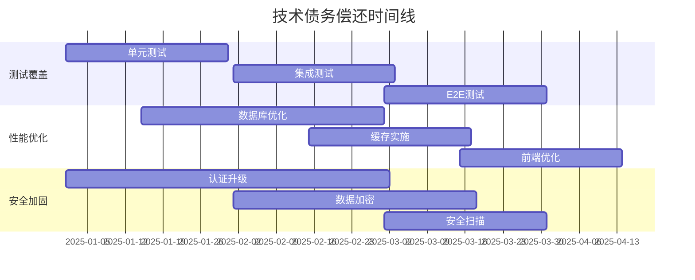

# Star-Man 架构扩展规划

> 规划版本: v2.0  
> 规划时间: 2025-08-26  
> 目标时间: 2025-2026年  

## 🎯 扩展目标与愿景

### 产品愿景
将 Star-Man 从个人 GitHub 星标管理工具升级为 **智能化的开发者知识管理平台**，支持多代码托管平台、AI 驱动的内容发现与推荐，以及团队协作功能。

### 核心指标目标

| 指标类别 | 当前状态 | 6个月目标 | 12个月目标 | 18个月目标 |
|----------|----------|-----------|------------|------------|
| **用户规模** | 单用户 | 1000+ | 10000+ | 50000+ |
| **数据规模** | 5K仓库/用户 | 20K仓库/用户 | 100K仓库/用户 | 500K仓库/用户 |
| **平台支持** | GitHub | +GitLab | +Gitee, Bitbucket | 全平台 |
| **响应时间** | 500ms | 200ms | 100ms | 50ms |
| **可用性** | 99% | 99.5% | 99.9% | 99.99% |

---

## 🏗️ 架构演进路线图

### Phase 1: 微服务化 (0-6个月)

#### 1.1 服务拆分设计

```
┌─────────────────────────────────────────┐
│                API Gateway              │
│         (Authentication & Routing)       │
└─────────────────────────────────────────┘
                        │
    ┌───────────────────┼───────────────────┐
    │                   │                   │
┌───▼────┐        ┌────▼─────┐        ┌───▼─────┐
│ User   │        │ Repo     │        │ Sync    │
│Service │        │ Service  │        │ Service │
└────────┘        └──────────┘        └─────────┘
    │                   │                   │
    ├─────────────────▼─▼─────────────────▼─┤
    │            Message Bus (Redis)        │
    └─────────────────────────────────────▲─┘
                                          │
    ┌─────────────────────────────────────▼─┐
    │         Data Layer (分布式)           │
    │  ┌─────────┐ ┌─────────┐ ┌─────────┐  │
    │  │User DB  │ │Repo DB  │ │Cache    │  │
    │  │(MySQL)  │ │(MySQL)  │ │(Redis)  │  │
    │  └─────────┘ └─────────┘ └─────────┘  │
    └───────────────────────────────────────┘
```

**服务划分:**

```typescript
// 用户服务
interface UserService {
  // 用户认证与授权
  authenticate(token: string): Promise<User>;
  register(userData: RegisterData): Promise<User>;
  updateProfile(userId: string, data: ProfileData): Promise<void>;
  
  // 偏好设置
  getPreferences(userId: string): Promise<Preferences>;
  updatePreferences(userId: string, prefs: Preferences): Promise<void>;
}

// 仓库服务  
interface RepoService {
  // 仓库查询与管理
  getRepos(userId: string, options: QueryOptions): Promise<RepoResult>;
  updateRepoTags(repoId: string, tags: string[]): Promise<void>;
  unstarRepo(userId: string, repoId: string): Promise<void>;
  
  // 智能分析
  analyzeRepo(repo: RepoData): Promise<AnalysisResult>;
  categorizeRepos(repos: RepoData[]): Promise<CategorizedRepos>;
}

// 同步服务
interface SyncService {
  // 多平台同步
  syncGitHub(userId: string): Promise<SyncResult>;
  syncGitLab(userId: string): Promise<SyncResult>;
  syncGitee(userId: string): Promise<SyncResult>;
  
  // 增量同步
  incrementalSync(userId: string, since: Date): Promise<SyncResult>;
  scheduledSync(userId: string, schedule: CronSchedule): Promise<void>;
}
```

#### 1.2 事件驱动架构

```typescript
// 事件总线设计
interface EventBus {
  publish<T>(event: EventType, payload: T): Promise<void>;
  subscribe<T>(event: EventType, handler: EventHandler<T>): Promise<void>;
}

// 核心事件定义
enum EventType {
  USER_REGISTERED = 'user.registered',
  REPO_STARRED = 'repo.starred',
  REPO_UNSTARRED = 'repo.unstarred',
  SYNC_COMPLETED = 'sync.completed',
  REPO_ANALYZED = 'repo.analyzed',
}

// 事件处理示例
class RepoEventHandler {
  @EventHandler(EventType.REPO_STARRED)
  async handleRepoStarred(event: RepoStarredEvent) {
    // 触发智能分析
    await this.analyzeService.analyzeRepo(event.repo);
    
    // 更新推荐引擎
    await this.recommendService.updateUserProfile(event.userId);
    
    // 发送通知
    await this.notificationService.notify(event.userId, {
      type: 'REPO_STARRED',
      message: `Successfully starred ${event.repo.name}`
    });
  }
}
```

#### 1.3 API 网关设计

```typescript
// API 网关配置
interface GatewayConfig {
  routes: RouteConfig[];
  middleware: MiddlewareConfig[];
  rateLimiting: RateLimitConfig;
  authentication: AuthConfig;
}

const gatewayConfig: GatewayConfig = {
  routes: [
    {
      path: '/api/users/*',
      service: 'user-service',
      loadBalancer: 'round-robin',
      healthCheck: '/health'
    },
    {
      path: '/api/repos/*', 
      service: 'repo-service',
      loadBalancer: 'least-connections',
      timeout: 10000
    },
    {
      path: '/api/sync/*',
      service: 'sync-service', 
      retries: 3,
      circuitBreaker: true
    }
  ],
  middleware: [
    { name: 'cors', config: { origin: '*' } },
    { name: 'helmet', config: { hsts: true } },
    { name: 'compression', config: { level: 6 } }
  ],
  rateLimiting: {
    windowMs: 900000, // 15分钟
    max: 100,         // 每IP限制100请求
    keyGenerator: (req) => req.ip
  }
};
```

### Phase 2: 多平台支持 (6-12个月)

#### 2.1 统一适配器模式

```typescript
// 平台适配器接口
interface PlatformAdapter {
  readonly platform: Platform;
  authenticate(credentials: Credentials): Promise<AuthResult>;
  getStarredRepos(userId: string, options?: QueryOptions): Promise<RepoData[]>;
  unstarRepo(userId: string, repoId: string): Promise<void>;
  getRepoDetails(repoId: string): Promise<RepoDetails>;
  searchRepos(query: string, filters: SearchFilters): Promise<RepoData[]>;
}

// GitHub 适配器实现
class GitHubAdapter implements PlatformAdapter {
  readonly platform = Platform.GITHUB;
  
  constructor(private octokit: Octokit) {}
  
  async getStarredRepos(userId: string): Promise<RepoData[]> {
    // GitHub API 调用逻辑
    const response = await this.octokit.rest.activity.listReposStarredByAuthenticatedUser();
    return response.data.map(repo => this.transformGitHubRepo(repo));
  }
  
  private transformGitHubRepo(githubRepo: any): RepoData {
    return {
      id: githubRepo.id,
      platform: Platform.GITHUB,
      name: githubRepo.name,
      fullName: githubRepo.full_name,
      // ... 标准化字段映射
    };
  }
}

// GitLab 适配器实现  
class GitLabAdapter implements PlatformAdapter {
  readonly platform = Platform.GITLAB;
  
  constructor(private gitlab: GitLabAPI) {}
  
  async getStarredRepos(userId: string): Promise<RepoData[]> {
    const projects = await this.gitlab.UserProjects.all({
      starred: true,
      userId: userId
    });
    return projects.map(project => this.transformGitLabRepo(project));
  }
  
  private transformGitLabRepo(gitlabProject: any): RepoData {
    return {
      id: gitlabProject.id,
      platform: Platform.GITLAB,
      name: gitlabProject.name,
      fullName: gitlabProject.path_with_namespace,
      // ... GitLab 字段映射
    };
  }
}

// 平台管理器
class PlatformManager {
  private adapters = new Map<Platform, PlatformAdapter>();
  
  registerAdapter(adapter: PlatformAdapter) {
    this.adapters.set(adapter.platform, adapter);
  }
  
  async syncAllPlatforms(userId: string): Promise<SyncResult[]> {
    const results = [];
    
    for (const [platform, adapter] of this.adapters) {
      try {
        const repos = await adapter.getStarredRepos(userId);
        const result = await this.processPlatformRepos(userId, platform, repos);
        results.push(result);
      } catch (error) {
        console.error(`Failed to sync ${platform}:`, error);
        results.push({ platform, error: error.message, success: false });
      }
    }
    
    return results;
  }
}
```

#### 2.2 数据模型标准化

```typescript
// 统一仓库模型
interface UniversalRepo {
  id: string;
  platform: Platform;
  platformId: string;        // 平台内的原始ID
  name: string;
  fullName: string;
  owner: RepoOwner;
  description?: string;
  language?: string;
  topics: string[];
  
  // 统一的度量指标
  metrics: {
    stars: number;
    forks: number;
    watchers: number;
    issues: number;
    pullRequests: number;
    commits: number;
  };
  
  // 统一的时间字段
  timestamps: {
    created: Date;
    updated: Date;
    pushed?: Date;
    starred: Date;
  };
  
  // 平台特定数据
  platformData: Record<string, any>;
  
  // 扩展分析数据
  analysis: {
    category: string;
    tags: string[];
    confidence: number;
    healthScore: number;      // 仓库健康度评分
    trendingScore: number;    // 趋势热度评分
  };
}

// 平台枚举
enum Platform {
  GITHUB = 'github',
  GITLAB = 'gitlab', 
  GITEE = 'gitee',
  BITBUCKET = 'bitbucket',
  SOURCEFORGE = 'sourceforge'
}
```

### Phase 3: AI 驱动的智能化 (12-18个月)

#### 3.1 智能推荐系统

```typescript
// 推荐引擎接口
interface RecommendationEngine {
  // 基于内容的推荐
  getContentBasedRecommendations(userId: string, limit: number): Promise<RepoRecommendation[]>;
  
  // 协同过滤推荐
  getCollaborativeRecommendations(userId: string, limit: number): Promise<RepoRecommendation[]>;
  
  // 混合推荐
  getHybridRecommendations(userId: string, options: RecommendationOptions): Promise<RecommendationResult>;
  
  // 趋势推荐
  getTrendingRecommendations(category?: string, timeWindow?: TimeWindow): Promise<RepoRecommendation[]>;
}

// 推荐算法实现
class HybridRecommendationEngine implements RecommendationEngine {
  constructor(
    private vectorService: VectorService,
    private mlService: MachineLearningService,
    private graphService: GraphService
  ) {}
  
  async getHybridRecommendations(userId: string, options: RecommendationOptions): Promise<RecommendationResult> {
    // 1. 用户画像构建
    const userProfile = await this.buildUserProfile(userId);
    
    // 2. 多路召回
    const [contentBased, collaborative, trending] = await Promise.all([
      this.getContentBasedCandidates(userProfile, options.limit * 3),
      this.getCollaborativeCandidates(userId, options.limit * 3),
      this.getTrendingCandidates(userProfile.interests, options.limit)
    ]);
    
    // 3. 特征工程
    const candidates = this.mergeCandidates([contentBased, collaborative, trending]);
    const features = await this.extractFeatures(candidates, userProfile);
    
    // 4. 排序模型预测
    const scores = await this.mlService.predict(features);
    
    // 5. 重排序和多样性优化
    const recommendations = this.rerank(candidates, scores, options.diversityFactor);
    
    return {
      recommendations: recommendations.slice(0, options.limit),
      explanation: this.generateExplanations(recommendations, userProfile),
      confidence: this.calculateConfidence(scores)
    };
  }
  
  private async buildUserProfile(userId: string): Promise<UserProfile> {
    const starredRepos = await this.repoService.getUserRepos(userId);
    
    return {
      languages: this.extractLanguagePreferences(starredRepos),
      categories: this.extractCategoryPreferences(starredRepos), 
      topics: this.extractTopicPreferences(starredRepos),
      activityPattern: await this.analyzeActivityPattern(userId),
      similarUsers: await this.findSimilarUsers(userId),
      embedding: await this.vectorService.getUserEmbedding(userId)
    };
  }
}
```

#### 3.2 语义搜索系统

```typescript
// 向量搜索服务
class VectorSearchService {
  constructor(
    private vectorDB: VectorDatabase,  // Pinecone, Weaviate, or Qdrant
    private embeddingModel: EmbeddingModel  // OpenAI, HuggingFace, or Custom
  ) {}
  
  async indexRepository(repo: UniversalRepo): Promise<void> {
    // 1. 构建搜索文档
    const document = this.buildSearchDocument(repo);
    
    // 2. 生成向量嵌入
    const embedding = await this.embeddingModel.embed(document);
    
    // 3. 存储到向量数据库
    await this.vectorDB.upsert({
      id: repo.id,
      values: embedding,
      metadata: {
        platform: repo.platform,
        language: repo.language,
        category: repo.analysis.category,
        stars: repo.metrics.stars,
        updated: repo.timestamps.updated.getTime()
      }
    });
  }
  
  async semanticSearch(query: string, filters: SearchFilters = {}): Promise<SearchResult[]> {
    // 1. 查询向量化
    const queryEmbedding = await this.embeddingModel.embed(query);
    
    // 2. 向量相似度搜索
    const searchResults = await this.vectorDB.query({
      vector: queryEmbedding,
      topK: filters.limit || 50,
      filter: this.buildVectorFilter(filters),
      includeMetadata: true
    });
    
    // 3. 结果后处理
    return this.postProcessResults(searchResults, query, filters);
  }
  
  private buildSearchDocument(repo: UniversalRepo): string {
    return [
      repo.name,
      repo.description || '',
      repo.language || '',
      repo.topics.join(' '),
      repo.analysis.category,
      repo.analysis.tags.join(' ')
    ].filter(Boolean).join(' ');
  }
  
  async findSimilarRepos(repoId: string, limit: number = 10): Promise<SimilarRepo[]> {
    // 基于仓库向量找相似仓库
    const repoEmbedding = await this.vectorDB.fetch([repoId]);
    
    if (!repoEmbedding.vectors[repoId]) {
      throw new Error(`Repository ${repoId} not found in vector database`);
    }
    
    const similarRepos = await this.vectorDB.query({
      vector: repoEmbedding.vectors[repoId].values,
      topK: limit + 1, // +1 to exclude self
      includeMetadata: true
    });
    
    // 排除自己，返回相似仓库
    return similarRepos.matches
      .filter(match => match.id !== repoId)
      .map(match => ({
        id: match.id,
        similarity: match.score,
        metadata: match.metadata
      }));
  }
}
```

#### 3.3 自然语言查询

```typescript
// NL2SQL 查询引擎
class NaturalLanguageQueryEngine {
  constructor(
    private llmService: LLMService,
    private sqlExecutor: SQLExecutor,
    private schemaManager: SchemaManager
  ) {}
  
  async processNaturalLanguage(query: string, userId: string): Promise<QueryResult> {
    // 1. 意图识别
    const intent = await this.identifyIntent(query);
    
    // 2. 实体抽取
    const entities = await this.extractEntities(query);
    
    // 3. SQL 生成
    const sqlQuery = await this.generateSQL(query, intent, entities);
    
    // 4. 查询执行
    const results = await this.sqlExecutor.execute(sqlQuery, userId);
    
    // 5. 结果解释
    const explanation = await this.generateExplanation(query, results);
    
    return {
      query: sqlQuery,
      results,
      explanation,
      confidence: intent.confidence
    };
  }
  
  private async generateSQL(query: string, intent: Intent, entities: Entity[]): Promise<string> {
    const prompt = `
Given the database schema:
${await this.schemaManager.getSchemaDescription()}

And the user query: "${query}"

With extracted entities: ${JSON.stringify(entities)}
And detected intent: ${JSON.stringify(intent)}

Generate a SQL query to answer the user's question:
`;

    const response = await this.llmService.complete({
      prompt,
      maxTokens: 500,
      temperature: 0.1  // Low temperature for consistent SQL generation
    });
    
    return this.validateAndCleanSQL(response.text);
  }
  
  // 示例查询处理
  async handleExampleQueries() {
    const examples = [
      "Show me all React repositories starred in the last month",
      "Find Python projects with more than 1000 stars", 
      "What are the trending Machine Learning repositories?",
      "Show repositories similar to tensorflow",
      "List all frontend frameworks I've starred"
    ];
    
    for (const query of examples) {
      const result = await this.processNaturalLanguage(query, 'user123');
      console.log(`Query: ${query}`);
      console.log(`SQL: ${result.query}`);
      console.log(`Results: ${result.results.length} items`);
      console.log(`Explanation: ${result.explanation}`);
      console.log('---');
    }
  }
}
```

### Phase 4: 团队协作与企业功能 (18-24个月)

#### 4.1 团队管理系统

```typescript
// 团队模型设计
interface Team {
  id: string;
  name: string;
  description?: string;
  avatar?: string;
  
  // 团队设置
  settings: {
    visibility: 'private' | 'public' | 'internal';
    joinPolicy: 'open' | 'approval' | 'invite-only';
    syncSchedule: CronSchedule;
    allowedPlatforms: Platform[];
  };
  
  // 成员管理
  members: TeamMember[];
  invitations: TeamInvitation[];
  
  // 统计信息
  stats: {
    totalRepos: number;
    totalMembers: number;
    createdAt: Date;
    lastActivity: Date;
  };
}

interface TeamMember {
  userId: string;
  role: TeamRole;
  permissions: Permission[];
  joinedAt: Date;
  lastActive: Date;
}

enum TeamRole {
  OWNER = 'owner',
  ADMIN = 'admin', 
  MEMBER = 'member',
  VIEWER = 'viewer'
}

// 团队服务实现
class TeamService {
  async createTeam(ownerId: string, teamData: CreateTeamData): Promise<Team> {
    const team = await this.db.team.create({
      data: {
        ...teamData,
        members: {
          create: {
            userId: ownerId,
            role: TeamRole.OWNER,
            permissions: await this.getAllPermissions()
          }
        }
      }
    });
    
    // 发送团队创建事件
    await this.eventBus.publish(EventType.TEAM_CREATED, {
      teamId: team.id,
      ownerId,
      timestamp: new Date()
    });
    
    return team;
  }
  
  async inviteMembers(teamId: string, inviterId: string, emails: string[]): Promise<TeamInvitation[]> {
    // 权限检查
    await this.checkPermission(inviterId, teamId, Permission.INVITE_MEMBERS);
    
    const invitations = [];
    
    for (const email of emails) {
      const invitation = await this.db.teamInvitation.create({
        data: {
          teamId,
          inviterId,
          email,
          token: this.generateInviteToken(),
          expiresAt: new Date(Date.now() + 7 * 24 * 60 * 60 * 1000) // 7天过期
        }
      });
      
      // 发送邀请邮件
      await this.emailService.sendTeamInvitation({
        to: email,
        teamName: await this.getTeamName(teamId),
        inviteLink: `${process.env.WEB_URL}/teams/join/${invitation.token}`
      });
      
      invitations.push(invitation);
    }
    
    return invitations;
  }
  
  async getTeamRepos(teamId: string, options: QueryOptions): Promise<TeamRepoResult> {
    // 聚合所有成员的仓库
    const members = await this.getTeamMembers(teamId);
    const memberIds = members.map(m => m.userId);
    
    const repos = await this.repoService.getReposByUsers(memberIds, {
      ...options,
      includeOwnerInfo: true
    });
    
    // 团队仓库统计
    const stats = await this.calculateTeamRepoStats(repos);
    
    return {
      repos,
      stats,
      members: memberIds.length,
      totalRepos: repos.length
    };
  }
}
```

#### 4.2 知识库系统

```typescript
// 知识库模型
interface KnowledgeBase {
  id: string;
  teamId: string;
  name: string;
  description?: string;
  
  // 知识条目
  articles: Article[];
  categories: Category[];
  tags: KnowledgeTag[];
  
  // 配置
  settings: {
    isPublic: boolean;
    allowComments: boolean;
    requireApproval: boolean;
    searchable: boolean;
  };
  
  // 统计
  stats: {
    totalArticles: number;
    totalViews: number;
    totalContributors: number;
    lastUpdated: Date;
  };
}

interface Article {
  id: string;
  title: string;
  content: string;        // Markdown 格式
  summary?: string;
  
  // 关联的仓库
  relatedRepos: RepoReference[];
  
  // 元数据
  metadata: {
    authorId: string;
    categoryId?: string;
    tags: string[];
    status: ArticleStatus;
    version: number;
  };
  
  // 互动数据
  interactions: {
    views: number;
    likes: number;
    comments: Comment[];
    shares: number;
  };
  
  timestamps: {
    createdAt: Date;
    updatedAt: Date;
    publishedAt?: Date;
  };
}

// 知识库服务
class KnowledgeBaseService {
  async createArticle(data: CreateArticleData): Promise<Article> {
    // 1. 内容分析和预处理
    const processedContent = await this.preprocessContent(data.content);
    
    // 2. 自动标签提取
    const suggestedTags = await this.extractTags(data.content);
    
    // 3. 相关仓库推荐
    const relatedRepos = await this.findRelatedRepos(data.content);
    
    // 4. 创建文章
    const article = await this.db.article.create({
      data: {
        ...data,
        content: processedContent,
        suggestedTags,
        relatedRepos: {
          create: relatedRepos.map(repo => ({ repoId: repo.id }))
        }
      }
    });
    
    // 5. 全文索引
    await this.searchService.indexArticle(article);
    
    return article;
  }
  
  async searchKnowledge(query: string, filters: KnowledgeSearchFilters): Promise<SearchResult[]> {
    // 组合搜索：全文 + 语义 + 标签
    const [fullTextResults, semanticResults, tagResults] = await Promise.all([
      this.searchService.fullTextSearch(query, filters),
      this.vectorService.semanticSearch(query, 'knowledge'),
      this.tagService.searchByTags(this.extractHashtags(query))
    ]);
    
    // 结果融合和排序
    return this.mergeSearchResults([fullTextResults, semanticResults, tagResults]);
  }
  
  async generateArticleSummary(articleId: string): Promise<string> {
    const article = await this.getArticle(articleId);
    
    // 使用 LLM 生成摘要
    const summary = await this.llmService.complete({
      prompt: `Summarize the following technical article in 2-3 sentences:\n\n${article.content}`,
      maxTokens: 150,
      temperature: 0.3
    });
    
    return summary.text;
  }
}
```

#### 4.3 企业级功能

```typescript
// 企业版功能配置
interface EnterpriseFeatures {
  // 访问控制
  accessControl: {
    ssoProvider?: SSOProvider;
    ldapIntegration?: LDAPConfig;
    roleBasedAccess: boolean;
    ipWhitelist?: string[];
  };
  
  // 审计日志
  auditLog: {
    enabled: boolean;
    retentionDays: number;
    logLevel: 'basic' | 'detailed' | 'comprehensive';
    complianceMode: boolean;
  };
  
  // 数据治理
  dataGovernance: {
    dataRetention: RetentionPolicy;
    privacyControls: PrivacyConfig;
    complianceReports: boolean;
    dataExport: boolean;
  };
  
  // 集成能力
  integrations: {
    jira?: JiraConfig;
    slack?: SlackConfig;
    webhook?: WebhookConfig;
    customAPI?: APIConfig;
  };
}

// SSO 集成示例
class SSOService {
  async configureSAML(config: SAMLConfig): Promise<void> {
    // SAML 2.0 配置
    const samlStrategy = new SAMLStrategy({
      entryPoint: config.ssoUrl,
      issuer: config.issuer,
      cert: config.certificate,
      callbackUrl: `${process.env.API_URL}/auth/saml/callback`
    });
    
    passport.use('saml', samlStrategy);
  }
  
  async configureOIDC(config: OIDCConfig): Promise<void> {
    // OpenID Connect 配置
    const oidcStrategy = new OpenIDConnectStrategy({
      issuer: config.issuer,
      clientID: config.clientId,
      clientSecret: config.clientSecret,
      callbackURL: `${process.env.API_URL}/auth/oidc/callback`
    });
    
    passport.use('oidc', oidcStrategy);
  }
}

// 审计日志服务
class AuditLogService {
  async logAction(action: AuditAction): Promise<void> {
    const logEntry = {
      timestamp: new Date(),
      userId: action.userId,
      action: action.type,
      resource: action.resource,
      details: action.details,
      ipAddress: action.ipAddress,
      userAgent: action.userAgent,
      result: action.result
    };
    
    // 写入审计日志
    await this.db.auditLog.create({ data: logEntry });
    
    // 实时异常检测
    if (this.isAnomalousActivity(action)) {
      await this.alertService.sendSecurityAlert(logEntry);
    }
  }
  
  async generateComplianceReport(startDate: Date, endDate: Date): Promise<ComplianceReport> {
    const logs = await this.db.auditLog.findMany({
      where: {
        timestamp: { gte: startDate, lte: endDate }
      }
    });
    
    return {
      period: { start: startDate, end: endDate },
      totalActions: logs.length,
      userActions: this.groupByUser(logs),
      resourceAccess: this.groupByResource(logs),
      securityEvents: this.extractSecurityEvents(logs),
      complianceScore: this.calculateComplianceScore(logs)
    };
  }
}
```

---

## 📊 技术栈演进

### 当前技术栈
```yaml
Backend:
  - Node.js + TypeScript
  - Prisma ORM + SQLite
  - Express.js
  - @octokit/rest

Frontend: 
  - React + TypeScript
  - TanStack Router
  - Tailwind CSS + DaisyUI

Infrastructure:
  - 单体应用部署
  - 本地数据库
```

### 目标技术栈 (Phase 4)
```yaml
Backend Microservices:
  - Node.js/Go 混合
  - gRPC 服务间通信
  - GraphQL Federation
  - Redis + PostgreSQL + Vector DB

Message Queue:
  - Apache Kafka / Redis Streams
  - Event Sourcing + CQRS

API Layer:
  - GraphQL Gateway
  - REST API (向后兼容)
  - WebSocket (实时功能)

Frontend:
  - Next.js + React
  - GraphQL + Apollo Client
  - Micro-frontend 架构

AI/ML Stack:
  - Python FastAPI 服务
  - Vector Database (Pinecone/Weaviate)
  - Transformer Models
  - MLOps Pipeline

Infrastructure:
  - Kubernetes
  - Service Mesh (Istio)
  - Observability Stack
  - Multi-cloud deployment
```

---

## 🚀 实施时间表

### 2025 Q1-Q2: 微服务化基础

| 周期 | 里程碑 | 交付物 | 成功标准 |
|------|--------|--------|----------|
| Week 1-4 | 服务拆分设计 | 微服务架构图、API设计 | 架构评审通过 |
| Week 5-8 | User Service | 用户认证与管理服务 | 单元测试覆盖80%+ |
| Week 9-12 | Repo Service | 仓库管理服务 | 性能达到设计要求 |
| Week 13-16 | Sync Service | 同步服务重构 | 支持多平台同步 |
| Week 17-20 | API Gateway | 网关和路由配置 | 99.9%可用性 |
| Week 21-24 | 部署和监控 | K8s部署、监控告警 | 生产环境稳定运行 |

### 2025 Q3-Q4: 多平台与AI功能

| 周期 | 里程碑 | 交付物 | 成功标准 |
|------|--------|--------|----------|
| Week 25-28 | GitLab集成 | GitLab适配器开发 | 功能对等GitHub |
| Week 29-32 | Gitee集成 | Gitee适配器开发 | 支持中文生态 |
| Week 33-36 | 向量搜索 | 语义搜索功能 | 搜索准确率85%+ |
| Week 37-40 | 推荐系统 | 智能推荐引擎 | CTR提升20%+ |
| Week 41-44 | NLP查询 | 自然语言接口 | 意图识别准确率90%+ |
| Week 45-48 | 移动端适配 | PWA和响应式优化 | 移动端体验优秀 |

### 2026 Q1-Q2: 团队协作功能

| 周期 | 里程碑 | 交付物 | 成功标准 |
|------|--------|--------|----------|
| Week 1-6 | 团队管理 | 团队创建、成员管理 | 支持1000+团队 |
| Week 7-12 | 协作功能 | 共享收藏、讨论区 | 用户活跃度提升 |
| Week 13-18 | 知识库 | 文档管理、知识沉淀 | 内容质量满意度85%+ |
| Week 19-24 | 企业功能 | SSO、审计、报表 | 企业客户转化率20%+ |

---

## 💰 商业化路径

### 产品矩阵

| 版本 | 目标用户 | 定价 | 核心功能 |
|------|----------|------|----------|
| **Free** | 个人开发者 | 免费 | 单用户、GitHub、基础功能 |
| **Pro** | 专业开发者 | $9/月 | 多平台、AI搜索、高级统计 |
| **Team** | 小团队 | $29/月/10人 | 团队协作、知识库、API |
| **Enterprise** | 大企业 | $199/月/100人 | SSO、审计、定制化 |

### 收入模式

1. **订阅收入** (主要)
   - SaaS订阅模式
   - 按用户数量计费
   - 年付折扣策略

2. **API收入** (补充)
   - API调用计费
   - 第三方集成服务
   - 数据导出服务

3. **企业服务** (高价值)
   - 私有化部署
   - 定制开发
   - 技术支持服务

### 成本结构

| 成本类别 | 年度预算(万美元) | 占比 |
|----------|------------------|------|
| 云基础设施 | 50 | 25% |
| 人力成本 | 120 | 60% |
| 第三方服务 | 20 | 10% |
| 营销推广 | 10 | 5% |

---

## 🎯 成功指标

### 技术指标

| 指标 | 当前 | 6个月目标 | 12个月目标 |
|------|------|-----------|------------|
| 系统可用性 | 99% | 99.5% | 99.9% |
| API响应时间 | 500ms | 200ms | 100ms |
| 数据库查询 | 200ms | 50ms | 20ms |
| 错误率 | 5% | 1% | 0.5% |

### 业务指标

| 指标 | 当前 | 6个月目标 | 12个月目标 |
|------|------|-----------|------------|
| 日活用户(DAU) | - | 1000 | 5000 |
| 付费用户 | 0 | 100 | 1000 |
| 用户留存率(30天) | - | 60% | 75% |
| NPS得分 | - | 50+ | 70+ |

### 产品指标

| 指标 | 当前 | 6个月目标 | 12个月目标 |
|------|------|-----------|------------|
| 支持平台数量 | 1 | 3 | 5 |
| 平均仓库数/用户 | 5000 | 8000 | 12000 |
| 搜索查询/日 | - | 10000 | 50000 |
| API调用/日 | - | 100000 | 1000000 |

---

## 🔧 技术债务管理

### 当前技术债务

1. **测试覆盖率不足** (高优先级)
   - 当前: 0%
   - 目标: 80%+
   - 行动: 补充单元测试、集成测试

2. **性能优化滞后** (中优先级)  
   - 数据库查询优化
   - 缓存策略实施
   - 前端性能优化

3. **安全加固不足** (高优先级)
   - 身份认证强化
   - 数据加密
   - 安全扫描

### 技术债务偿还计划



---

## 📋 风险评估与应对

### 技术风险

| 风险 | 概率 | 影响 | 应对策略 |
|------|------|------|----------|
| 微服务复杂度 | 中 | 高 | 逐步演进、充分测试 |
| 性能瓶颈 | 中 | 中 | 提前优化、监控告警 |
| 数据迁移 | 低 | 高 | 详细计划、回滚方案 |
| 第三方API限制 | 高 | 中 | 多平台支持、缓存策略 |

### 商业风险

| 风险 | 概率 | 影响 | 应对策略 |
|------|------|------|----------|
| 竞争对手 | 中 | 高 | 差异化定位、快速迭代 |
| 市场需求变化 | 低 | 高 | 用户调研、灵活调整 |
| 资金不足 | 中 | 高 | 融资计划、成本控制 |
| 团队扩张 | 中 | 中 | 人才储备、文化建设 |

### 运营风险

| 风险 | 概率 | 影响 | 应对策略 |
|------|------|------|----------|
| 服务中断 | 低 | 高 | 高可用架构、容灾计划 |
| 数据安全 | 低 | 极高 | 安全审计、合规认证 |
| 法律合规 | 低 | 高 | 法务咨询、隐私保护 |
| 用户流失 | 中 | 中 | 用户反馈、产品优化 |

---

通过这个全面的架构扩展规划，Star-Man 将从一个简单的个人工具发展成为一个功能完整的企业级开发者知识管理平台，具备强大的竞争优势和商业价值。